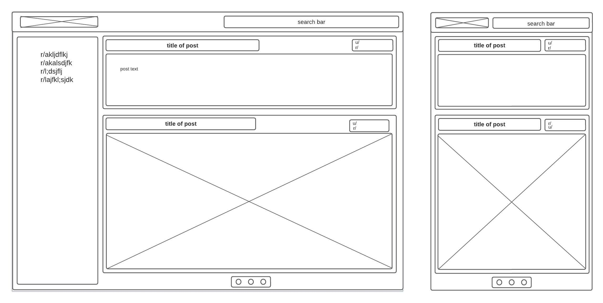

# Reddit Client
  This is a single-page application which is built with React and Redux. It allows the user to browse the reddit homepage, search for posts and subreddits, go to subreddit pages, and view post comments. It is compatable with all kinds of media present in reddit posts, being able to display whichever are necessary.

<!-- ## Wireframes
 -->

## Color Theme

The color theme is gray, white and blue, but can be changed by the user. 

## Technologies used

### Reddit API

All data in this app is fetched from one of Reddit's two APIs. The data is fetched according to the url and the actions of the user.

### React

All components are function components built with React. 

### Redux

React-Redux is used to manage state in this app. The main states are "posts", "navBar", and "sidebar". The states store the data received from the reddit

### React Router

React Router is used to manage page navigation. There are four different pages, home, search, subreddit and expanded post. According to the URL, these different pages are rendered and appropriate data is fetched for them.

### CSS-in-JS

In order for the user to change the app's color, CSS-in-JS is used to allow buttons and drop down menus to alter the app's appearancce.

## Features

### Sort posts according by "new", "hot" and "top"

This affects the order in whivhc the Reddit API sends the data to the Redux store. 

### Search

From any page, the user can search for post topics and subreddits. In order to do this, there is no need to 

### Customizability

This app offerres two different ways for users to change the appearance of the app:

#### Toggling between light and dark mode

The app begins in light mode, but there is a dark mode available if the user prefers it.

#### Toggling between different colors

THe default accent color of the app is blue, but if a user doesn't like that, they can change it to red, green, yellow, or back to blue if they have come to their senses.

## Future work

This app can be improved by displaying subreddit sidebar information, 

### Enable account access

allows the user to upvote and downvote, comment, post

### View more subreddit detail

It would be nice for the peripheral subreddit information to be displayed, such as thumbnail, header image, mods, rules, and so on.

### Add a user page

THe app ccould allow you to view all thed posts, comments, etc of a user. 